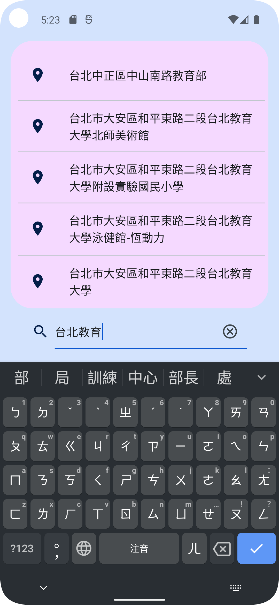
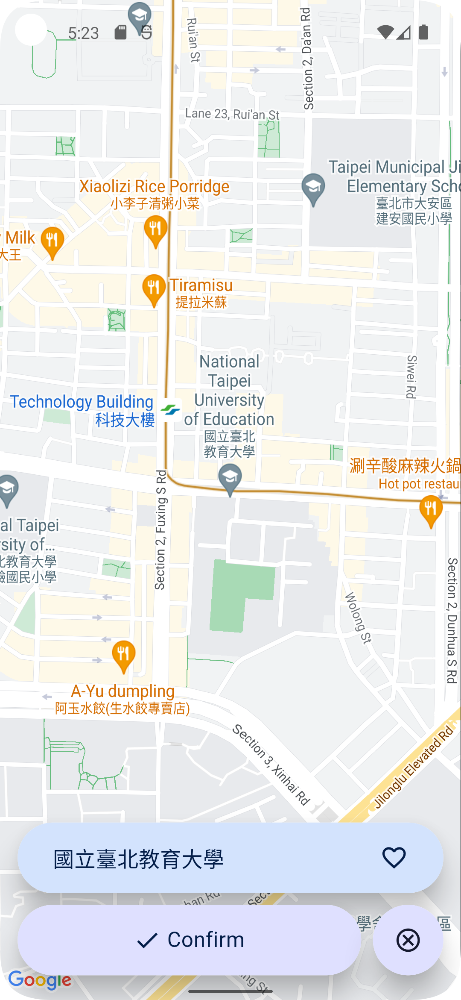

# 畢業專題 - 公車定位鬧鐘APP

UI設計  
https://www.figma.com/proto/clo1boyJskf7hxhSgp7uKp/%E5%88%B0%E7%AB%99%E6%8F%90%E9%86%92APP?page-id=0%3A1&node-id=212-80&viewport=-10%2C-632%2C0.71&scaling=scale-down&starting-point-node-id=3%3A4  

4/9
<table>
  <tr>
    <td></td>
    <td></td>
    <td></td>
    <!--<td></td>-->
  </tr>
  <tr>
    <td align="center">• 初始畫面</td>
    <td align="center">• 搜尋地點</td>
    <td align="center">• 確認頁面</td>
    <!--<td align="center">• 新增項目 (正負分別代表收入和支出)</td>-->
  </tr>
  <!--
  <tr>
    <td></td>
    <td></td>
    <td></td>
  </tr>
  <tr>
    <td align="center">• DatePicker</td>
    <td align="center">• 欄位不可為空白</td>
    <td align="center">• 點擊項目可以刪除</td>
  </tr>
  -->
</table>
