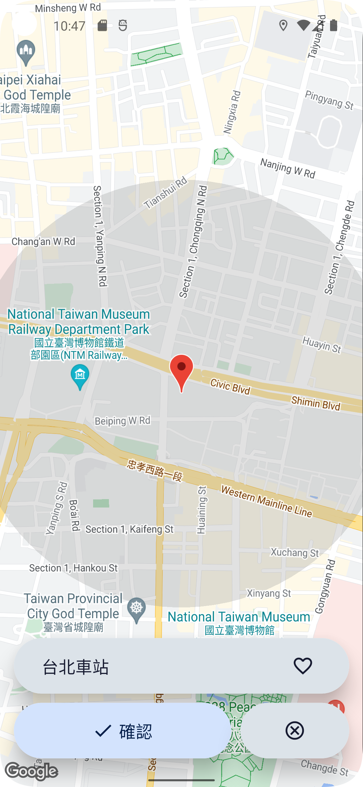

# 畢業專題 - 公車定位鬧鐘APP  

通勤時常常因為塞車路況不佳提早被鬧鐘吵醒，而需要再使用貪睡功能，越睡越累反而得到反效果，但藉由定位鬧鐘APP，利用實時的手機定位資訊，真的接近目的地時，手機才會觸發連續震動，讓通勤族不會再睡得提心吊膽，並且除非使用者主動關閉，否則會繼續震動，確保使用者已經確實從睡夢中清醒過來，大大提升在交通工具上的睡眠品質。

## 開發工具
- Figma
- Flutter
- Firebase
  - Authentication
  - Realtime Database
- Google Cloud
  - Maps SDK
  - Directions API
  - Geolocation API
  - Place API
- Transport Data eXchange
  - Bus/RealTimeByFrequency API
  - Bus/EstimatedTimeOfArrival API
  - Bus/StopOfRoute API


## UI設計  
搜尋目的地 -> 開始追蹤 -> 到達範圍開始震動手機    
  
🔗<a href="https://www.figma.com/proto/clo1boyJskf7hxhSgp7uKp/%E5%88%B0%E7%AB%99%E6%8F%90%E9%86%92APP?page-id=0%3A1&node-id=212-80&viewport=-10%2C-632%2C0.71&scaling=scale-down&starting-point-node-id=3%3A4/">www.figma.com/proto</a>  


## Flutter實作
4/9   
完成基本UI、GoogleMap嵌入、PlaceAPI串接
<table>
  <tr>
    <td></td>
    <td></td>
    <td></td>
    <!--<td></td>-->
  </tr>
  <tr>
    <td align="center">• 初始畫面</td>
    <td align="center">• 搜尋地點</td>
    <td align="center">• 確認頁面</td>
    <!--<td align="center">• 新增項目<br>(正負分別代表收入和支出)</td>-->
  </tr>
</table>


7/6   
完成地點儲存資料庫、更新確認頁面
<table>
  <tr>
    <td></td>
    <td></td>
    <td></td>
    <td></td>
  </tr>
  <tr>
    <td align="center">• 收藏地點</td>
    <td align="center">• 搜尋地點</td>
    <td align="center">• 確認頁面</td>
    <td align="center">• 追蹤中</td>
  </tr>
</table>


10/30   
取得使用者定位權限  
並完成公車API串接  
方便使用者查詢常用公車路線預估到站時間
<table>
  <tr>
    <td></td>
    <td></td>
    <td></td>
    <td></td>
  </tr>
  <tr>
    <td align="center">• 定位權限</td>
    <td align="center">• 搜尋公車</td>
    <td align="center">• 選取站牌</td>
    <td align="center">• 已抵達</td>
  </tr>
</table>


11/01   
Firebase Authentication 會員登入系統
<table>
  <tr>
    <td></td>
    <td></td>
    <td></td>
    <td></td>
  </tr>
  <tr>
    <td align="center">• 登入</td>
    <td align="center">• 註冊</td>
    <td align="center">• 忘記密碼</td>
    <td align="center">• 會員資料</td>
  </tr>
</table>


## SQLite：

因為公車路線查詢是後來才新增的功能  
為了讓公車API回傳的地點也能儲存在原本的資料庫  
額外透過GeocodingAPI利用經緯度查詢該站牌在Google地圖中的ID  
避免本地ID重複衝突
```
//已收藏的地點
favPlaces ──┬── id (PK)
            ├── name
            ├── latitude
            └── longitude
//歷史使用地點    
hisPlaces ──┬── id (PK)
            ├── name
            ├── latitude
            └── longitude
```
